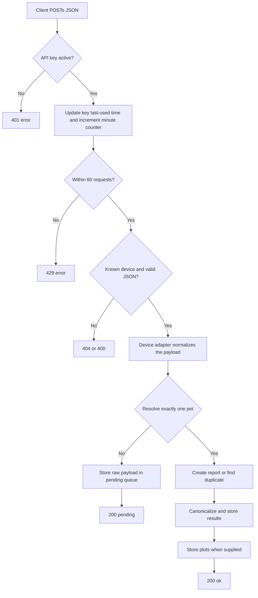

# Alies API

This document describes the complete inbound API implemented by this repository and how a device or other client must send data to it.

## Scope

The application currently exposes one API operation: importing laboratory results. It supports four payload formats:

- `ms4s2`
- `ikems`
- `lmscan`
- `medilab`

The API does not expose endpoints for reading, changing, or deleting owners, pets, reports, or results.

## Endpoint

```text
POST {BASE_URL}/api/lab/import/{device}
```

Replace `{BASE_URL}` with the URL at which this CodeIgniter application is installed and `{device}` with one of the four lowercase device names above. For example:

```text
POST https://alies.example/api/lab/import/ms4s2
```

The application uses normal CodeIgniter URI routing; no explicit route alias is configured. URL rewriting normally removes `index.php`. On an installation without rewriting, use:

```text
POST https://alies.example/index.php/api/lab/import/ms4s2
```

Use HTTPS in production because the API credential is sent with every request.

## Request requirements

Every request should contain:

```http
Content-Type: application/json
Accept: application/json
Authorization: Bearer YOUR_API_KEY
```

`X-API-Key` is also supported:

```http
X-API-Key: YOUR_API_KEY
```

Prefer `Authorization: Bearer ...`. Do not send both headers. If an `Authorization` header is present, it takes precedence even when it is malformed, so an accompanying valid `X-API-Key` will not rescue the request.

Although the current controller does not explicitly reject other HTTP methods, `POST` is the supported client contract. The body must be one JSON object, not form data, multipart data, an array of reports, or newline-delimited JSON. Send one report per request.

### API keys

An administrator manages credentials in **Tools > API Keys** (`/tools/show_api_keys`). The credential accepted by the API is the 64-character value stored/displayed as `key_hash`. Send that value exactly as issued; clients must not hash it again.

Keys can be revoked by an administrator. The `device` description attached to a key is currently informational: it does not restrict which device URL the key may call.

### Rate limit

Each key is limited to 60 requests per server-clock minute. Authentication failures do not consume the limit. Once authenticated, requests consume the limit even if the device is unknown or the payload is invalid. The 61st request in a minute receives HTTP `429`.

The response currently has no rate-limit or `Retry-After` headers. A client receiving `429` should wait until the next minute and retry with backoff. Although the database has a per-key `rate_limit` field, the current controller always uses the fixed limit of 60.

## Quick start

```bash
curl --request POST \
  'https://alies.example/api/lab/import/lmscan' \
  --header 'Authorization: Bearer YOUR_API_KEY' \
  --header 'Content-Type: application/json' \
  --header 'Accept: application/json' \
  --data '{
    "serial_number": "LMSCAN-2026-00042",
    "sample_id": "998193",
    "test_end_time": "2026-08-24T14:31:00+02:00",
    "project_number": "P-17",
    "project_name": "cPL",
    "sample_type": "serum",
    "result": "187.4",
    "unit": "ug/L",
    "ref_low": "0",
    "ref_high": "200"
  }'
```

A stored report returns:

```json
{"status":"ok"}
```

An accepted report whose pet cannot be identified returns:

```json
{"status":"pending"}
```

Both responses currently use HTTP `200`; clients must inspect `status`.

## End-to-end server flow



In detail:

1. `API_Controller` authenticates an active key.
2. It records `last_used_at` and increments that key's current-minute counter.
3. The URL selects a device adapter. Device names are case-sensitive and lowercase.
4. The controller decodes the raw request body as JSON.
5. The adapter converts the device-specific fields into the application's common lab-report structure.
6. The service attempts to associate the report with exactly one pet.
7. An unresolved report is saved with its raw payload in `lab_report_pending` and returns `pending`.
8. A resolved report is created in `lab_report`, with individual measurements in `lab_results`. MS4S2 plots are stored in `lab_plots`.
9. Device-specific measurement names are mapped to canonical codes where a mapping exists. Unknown codes are retained unchanged and logged by the server.

## Pet identification

Supplying the application's numeric pet ID is the most reliable integration method. The server tries these strategies in order and accepts name/chip searches only when exactly one pet matches:

1. Direct `pet_id`, if that ID exists.
2. Unique chip number.
3. Normalized phone number plus owner surname and pet name parsed from `OWNER/PET`.
4. Explicit owner surname plus pet name.
5. Owner/pet parsed from `OWNER/PET`.
6. Unique pet name as a last resort.

Phone normalization removes all non-digits from the incoming value. Owner surnames and pet names are compared in uppercase. Ambiguous or absent matches produce `status: pending`; the API does not guess.

## Device payloads

Fields marked **required** are directly read by the current adapter and must be present. Fields marked **recommended** may technically be omitted but are important for matching or duplicate protection. The API currently performs little schema validation, so a missing or incorrectly shaped field can cause an unstructured server error instead of a clean `400` response.

### MS4S2

Endpoint:

```text
POST {BASE_URL}/api/lab/import/ms4s2
```

Top-level fields:

| Field | Type | Requirement | Meaning |
| --- | --- | --- | --- |
| `id` | string | **required** | Stable report/source ID used for duplicate detection. |
| `pet_id` | numeric string or integer | **required** | Preferred Alies pet ID. It may be empty only if fallback identifiers can resolve the pet. |
| `owner_name` | string | **required** | Prefer `OWNER/PET` so name matching can be used as fallback. |
| `species` | string | **required** | Species; normalized to lowercase and otherwise not persisted by the current service. |
| `phone` | string | **required** | Owner phone; punctuation is allowed and removed for matching. |
| `year`, `month`, `day` | string or integer | **required** | Combined as `year-month-day` for `sample_date`; send a valid calendar date. |
| `experiments` | object | optional | Map of measurement code to measurement object. |
| `wbc_calc` | object | optional | Same shape as `experiments`; results from both groups are stored. |
| `plots` | object | optional | `THR`, `RBC`, and/or `WBC` arrays. Values are converted to integers. |
| `markers` | array | optional | Marker values converted to integers and saved in report metadata. |

Each `experiments` or `wbc_calc` value must contain:

| Field | Type | Requirement | Meaning |
| --- | --- | --- | --- |
| `value` | numeric/string | **required** | Converted to a floating-point measurement. |
| `unit` | string | **required** | Empty string becomes `null`. |
| `min` | numeric/string | **required** | Numeric value becomes the lower reference bound; non-numeric text such as `-` becomes `null`. |
| `max` | numeric/string | **required** | Numeric value becomes the upper reference bound; non-numeric text becomes `null`. |

Example:

```json
{
  "id": "MS4S2-0006",
  "pet_id": "998193",
  "owner_name": "KEPPENS/MAURICE",
  "species": "Cat",
  "phone": "0477.88.14.64",
  "year": "2026",
  "month": "08",
  "day": "24",
  "experiments": {
    "WBC": {"value": "5.66", "unit": "G/L", "min": "5", "max": "15"},
    "Hct": {"value": "40.2", "unit": "%", "min": "24", "max": "45"}
  },
  "wbc_calc": {
    "#Lym.": {"value": "1.38", "unit": "G/L", "min": "1.5", "max": "7"}
  },
  "plots": {
    "THR": [0, 1, 2, 1, 0],
    "RBC": [0, 3, 9, 3, 0],
    "WBC": [0, 2, 7, 2, 0]
  },
  "markers": [80, 85]
}
```

The measurement object's key is its native code. For example, `Hct` becomes canonical code `HCT`, and `#Lym.` becomes `LYM_ABS`.

### IKEMS

Endpoint:

```text
POST {BASE_URL}/api/lab/import/ikems
```

Top-level fields:

| Field | Type | Requirement | Meaning |
| --- | --- | --- | --- |
| `id` | string | **recommended** | Stable source ID used for duplicate detection. |
| `pet_id` | string/integer | **recommended** | One of three fields examined for numeric pet identification. |
| `patient_number` | string/integer | optional | Also examined for numeric pet identification or name fallback. |
| `pet_name` | string/integer | optional | Also examined for numeric pet identification or name fallback. |
| `chkdatetime` | string | recommended | Sample date in exactly `DD/MM/YYYY` format. Invalid values become `null`. |
| `experiments` | array | optional | Array of measurement objects. |
| `summary` | scalar | optional | If non-empty, stored as a text result with code `SUMMARY`. |
| `errorcode` | scalar | optional | If non-empty, stored as a text result with code `ERRORCODE`. |
| `software_version` | string | optional | Stored on the report. |
| `panel_id`, `panel_index`, `panel_lot`, `machine_id` | any JSON scalar | optional | Stored as JSON metadata. |

Each experiment has this shape:

```json
{"N":"GLU","I":["1.5","1.0","2.0","mmol/L"]}
```

- `N` is the measurement code.
- `I[0]` is the value.
- `I[1]` is the lower reference bound.
- `I[2]` is the upper reference bound.
- `I[3]` is the unit.

Always send all four `I` positions. Non-numeric bounds become `null`.

Example:

```json
{
  "id": "IKEMS-2026-0042",
  "pet_id": "192032",
  "patient_number": "VANHOYE",
  "pet_name": "BELLE",
  "chkdatetime": "24/08/2026",
  "software_version": "3.2.1",
  "machine_id": "IK-07",
  "panel_id": "CHEM-10",
  "panel_index": 4,
  "panel_lot": "LOT-991",
  "experiments": [
    {"N": "GLU", "I": ["1.5", "1.0", "2.0", "mmol/L"]},
    {"N": "CRE", "I": ["82", "44", "159", "umol/L"]}
  ],
  "summary": "OK"
}
```

IKEMS identification has legacy compatibility behavior: it examines `pet_id`, `patient_number`, and `pet_name`; the greatest digit-only value becomes the candidate Alies pet ID. Remaining non-numeric and numeric values are joined with ` / ` as the owner/name fallback. For predictable matching, put the real Alies ID in `pet_id` and avoid unrelated digit-only values in the other two identity fields.

### LMSCAN

Endpoint:

```text
POST {BASE_URL}/api/lab/import/lmscan
```

Each request represents one measurement:

| Field | Type | Requirement | Meaning |
| --- | --- | --- | --- |
| `serial_number` | string | **required** | Stable source/report ID used for duplicate detection. |
| `sample_id` | numeric string or integer | **recommended** | Alies pet ID. LMSCAN has no name, chip, or phone fallback. |
| `test_end_time` | string | **required** | Timestamp whose first 10 characters are stored as the sample date; begin with `YYYY-MM-DD`. |
| `project_number` | string | **required** | Stored in report metadata. |
| `project_name` | string | **required** | Measurement code. |
| `sample_type` | string | **required** | Stored in report metadata. |
| `result` | numeric/string | **required** | Converted to a floating-point value. |
| `unit` | string | **required** | Empty string becomes `null`. |
| `ref_low` | numeric/string | **required** | Numeric lower reference bound; otherwise `null`. |
| `ref_high` | numeric/string | **required** | Numeric upper reference bound; otherwise `null`. |

Example:

```json
{
  "serial_number": "LMSCAN-2026-00042",
  "sample_id": "998193",
  "test_end_time": "2026-08-24T14:31:00+02:00",
  "project_number": "P-17",
  "project_name": "cPL",
  "sample_type": "serum",
  "result": "187.4",
  "unit": "ug/L",
  "ref_low": "0",
  "ref_high": "200"
}
```

### Medilab

Endpoint:

```text
POST {BASE_URL}/api/lab/import/medilab
```

Top-level fields:

| Field | Type | Requirement | Meaning |
| --- | --- | --- | --- |
| `source` | string | recommended | Origin/laboratory name. |
| `source_id` | string | **recommended** | Stable report ID used for duplicate detection. |
| `patient` | string | **recommended** | Prefer `OWNER, (PET)` for owner/pet matching. |
| `sample_date` | string | recommended | Passed through to the report; use a database-compatible `YYYY-MM-DD` or `YYYY-MM-DD HH:MM:SS`. |
| `results` | array | optional | Measurement objects. |

Each result should contain:

| Field | Type | Requirement | Meaning |
| --- | --- | --- | --- |
| `lab_code` | string/integer | **required** | Fallback code and the special chip-test identifier. |
| `lab_name` | string | **required** | Preferred measurement code; use an empty string to fall back to `lab_code`. |
| `value` | numeric/string | **required** | Numeric result used when `text_value` is numeric. |
| `text_value` | string | **recommended** | Text result, or a numeric string for numeric results. See the note below. |
| `unit` | string | **required** | Empty string becomes `null`. |
| `min` | numeric/string | **required** | Numeric lower reference bound; otherwise `null`. |
| `max` | numeric/string | **required** | Numeric upper reference bound; otherwise `null`. |

Example:

```json
{
  "source": "medilab",
  "source_id": "ML-2026-87219",
  "patient": "PEETERS, (MILO)",
  "sample_date": "2026-08-24",
  "results": [
    {
      "lab_code": "1001",
      "lab_name": "Hemoglobine",
      "value": "14.2",
      "text_value": "14.2",
      "unit": "g/dL",
      "min": "12",
      "max": "18"
    },
    {
      "lab_code": "2002",
      "lab_name": "Interpretation",
      "value": "",
      "text_value": "normal",
      "unit": "",
      "min": "",
      "max": ""
    }
  ]
}
```

Important Medilab behaviors:

- A `patient` value matching `OWNER, (PET)` is split into owner and pet. Any other value is treated entirely as the owner name.
- Result `lab_code` `89114` is treated as a chip-number result. Its non-empty `text_value` may uniquely identify the pet.
- A result whose `text_value` is `niet medegedeeld` (case-insensitive) is discarded.
- For numeric results, send the numeric value in both `value` and `text_value`. The current adapter tests whether `text_value` is numeric, then reads the number from `value`.
- For textual results, put the text in `text_value`; it is stored as text.

## Responses and client behavior

| HTTP status | JSON body | Meaning | Client action |
| --- | --- | --- | --- |
| `200` | `{"status":"ok"}` | Pet resolved and report/results stored. | Mark delivery successful. |
| `200` | `{"status":"pending"}` | Payload accepted, but no unique pet was resolved. Raw data was queued for manual handling. | Mark as accepted/pending; do not blindly retry. |
| `400` | `{"status":"error","message":"Invalid JSON payload"}` | Body is empty, malformed JSON, or decodes to a non-object/non-array PHP value. | Correct serialization before retrying. |
| `401` | `{"status":"error","message":"Missing API key"}` | Neither supported credential header was supplied. | Configure the credential. |
| `401` | `{"status":"error","message":"Invalid API key"}` | Credential is unknown or revoked. | Obtain/activate the correct key. |
| `404` | Usually a CodeIgniter HTML error page | Device path is unsupported. | Correct the lowercase device name; do not retry unchanged. |
| `429` | `{"status":"error","message":"Rate limit exceeded"}` | More than 60 requests were made with this key in the current minute. | Wait and retry with backoff. |
| `500` or another unstructured response | Not guaranteed to be JSON | Malformed device schema, database failure, or another unhandled server error. | Log status and body, then retry only if safe or escalate. |

Only authentication, rate-limit, and invalid-JSON errors are guaranteed by the API controller to have the documented JSON error envelope. Clients should check both HTTP status and `Content-Type` before decoding error responses.

## Duplicate delivery and retries

Use a stable, non-empty source ID for every report:

- MS4S2: `id`
- IKEMS: `id`
- LMSCAN: `serial_number`
- Medilab: `source_id`

For a resolved report, a repeated `(device, source_id)` is treated as the same report. Its timestamp is touched, all prior measurement rows are deleted, and the newly submitted measurements are inserted. The existing report's pet, sample date, source, software version, and metadata are not updated.

This makes retries reasonably safe only when the same stable source ID always describes the same complete report. Keep these caveats in mind:

- If a source ID is absent, every delivery creates a new report.
- A `pending` delivery creates a new pending row on every retry; pending submissions are not deduplicated.
- Send the complete measurement set on every retry because a duplicate replaces all previous measurement rows.
- If a duplicate MS4S2 submission omits plots, previously stored plots remain. If it includes plots, the old plots are replaced.
- Storage is not wrapped in one database transaction. Treat an unexpected server error as an uncertain outcome and retry with the same stable source ID, never a new one.

A practical client policy is:

1. Generate/persist the device's stable source ID before sending.
2. Use connection and response timeouts.
3. On network failure or HTTP `5xx`, retry the same complete payload and source ID with exponential backoff.
4. On `429`, wait for the next minute and retry with jitter.
5. On `400`, `401`, or `404`, fix the request/configuration rather than automatically retrying.
6. Treat both `ok` and `pending` as accepted terminal responses. Surface `pending` for operator follow-up.

## Implementation map

The code involved in the API flow is:

| Responsibility | File |
| --- | --- |
| Authentication, rate limiting, JSON responses | `application/libraries/API_Controller.php` |
| Endpoint and device selection | `application/controllers/api/Lab.php` |
| Device payload normalization | `application/third_party/api/devices/*.php` |
| Pet resolution, duplicate handling, persistence | `application/libraries/LabResultService.php` |
| API-key lookup | `application/models/ApiKey_model.php` |
| Rate-limit counter | `application/models/ApiRate_model.php` |
| Report/result/pending persistence | `application/models/LabReport_model.php`, `LabResult_model.php`, `LabReportPending_model.php`, and `LabPlots_model.php` |
| Pet matching | `application/models/Pets_model.php` |
| Canonical measurement codes | `application/config/lab/canonical.php` |
| Tables and initial schema | `application/migrations/043_api_lab.php` |

## Current limitations

- There is no formal JSON Schema or API version in the URL.
- Device payload validation is incomplete; schema mistakes may surface as server errors.
- API keys authorize the entire API rather than a particular device.
- The configured per-key database rate limit is not used.
- Success responses do not include a report ID, pending ID, or request/correlation ID.
- Pending and persistence operations are not transactional or deduplicated end to end.
- The endpoint does not explicitly enforce `POST` or `Content-Type: application/json`; clients should still follow this documented contract.

