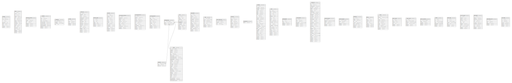

# alies

## Tables

| Name | Columns | Comment | Type |
| ---- | ------- | ------- | ---- |
| [badges](badges.md) | 9 |  | BASE TABLE |
| [bills](bills.md) | 18 |  | BASE TABLE |
| [booking_codes](booking_codes.md) | 7 |  | BASE TABLE |
| [breeds](breeds.md) | 10 |  | BASE TABLE |
| [ci_sessions](ci_sessions.md) | 4 |  | BASE TABLE |
| [config](config.md) | 5 |  | BASE TABLE |
| [delivery](delivery.md) | 17 |  | BASE TABLE |
| [delivery_slip](delivery_slip.md) | 7 |  | BASE TABLE |
| [events](events.md) | 15 |  | BASE TABLE |
| [events_procedures](events_procedures.md) | 11 |  | BASE TABLE |
| [events_products](events_products.md) | 12 |  | BASE TABLE |
| [events_upload](events_upload.md) | 10 |  | BASE TABLE |
| [groups](groups.md) | 3 |  | BASE TABLE |
| [lab](lab.md) | 12 |  | BASE TABLE |
| [lab_detail](lab_detail.md) | 15 |  | BASE TABLE |
| [log](log.md) | 8 |  | BASE TABLE |
| [login_attempts](login_attempts.md) | 4 |  | BASE TABLE |
| [log_stock](log_stock.md) | 9 |  | BASE TABLE |
| [migrations](migrations.md) | 1 |  | BASE TABLE |
| [owners](owners.md) | 29 |  | BASE TABLE |
| [pets](pets.md) | 22 |  | BASE TABLE |
| [pets_weight](pets_weight.md) | 5 |  | BASE TABLE |
| [procedures](procedures.md) | 7 |  | BASE TABLE |
| [products](products.md) | 33 |  | BASE TABLE |
| [products_price](products_price.md) | 6 |  | BASE TABLE |
| [products_type](products_type.md) | 5 |  | BASE TABLE |
| [register_in](register_in.md) | 9 |  | BASE TABLE |
| [sticky](sticky.md) | 8 |  | BASE TABLE |
| [stock](stock.md) | 12 |  | BASE TABLE |
| [stock_input](stock_input.md) | 6 |  | BASE TABLE |
| [stock_limit](stock_limit.md) | 6 |  | BASE TABLE |
| [stock_location](stock_location.md) | 5 |  | BASE TABLE |
| [tooth](tooth.md) | 7 |  | BASE TABLE |
| [tooth_msg](tooth_msg.md) | 7 |  | BASE TABLE |
| [users](users.md) | 28 |  | BASE TABLE |
| [users_groups](users_groups.md) | 3 |  | BASE TABLE |
| [vaccine_pet](vaccine_pet.md) | 11 |  | BASE TABLE |
| [wholesale](wholesale.md) | 11 |  | BASE TABLE |
| [wholesale_price](wholesale_price.md) | 5 |  | BASE TABLE |
| [zipcodes](zipcodes.md) | 7 |  | BASE TABLE |

## Relations

---

> Generated by [tbls](https://github.com/k1LoW/tbls)
