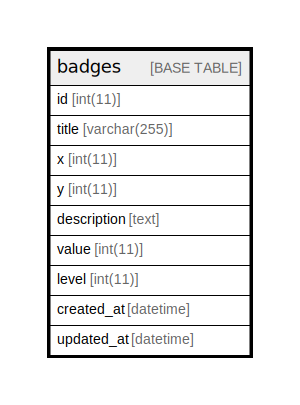

# badges

## Description

<details>
<summary><strong>Table Definition</strong></summary>

```sql
CREATE TABLE `badges` (
  `id` int(11) NOT NULL,
  `title` varchar(255) NOT NULL,
  `x` int(11) NOT NULL,
  `y` int(11) NOT NULL,
  `description` text NOT NULL,
  `value` int(11) NOT NULL,
  `level` int(11) NOT NULL,
  `created_at` datetime NOT NULL,
  `updated_at` datetime NOT NULL
) ENGINE=InnoDB DEFAULT CHARSET=utf8mb4 COLLATE=utf8mb4_general_ci
```

</details>

## Columns

| Name | Type | Default | Nullable | Children | Parents | Comment |
| ---- | ---- | ------- | -------- | -------- | ------- | ------- |
| id | int(11) |  | false |  |  |  |
| title | varchar(255) |  | false |  |  |  |
| x | int(11) |  | false |  |  |  |
| y | int(11) |  | false |  |  |  |
| description | text |  | false |  |  |  |
| value | int(11) |  | false |  |  |  |
| level | int(11) |  | false |  |  |  |
| created_at | datetime |  | false |  |  |  |
| updated_at | datetime |  | false |  |  |  |

## Relations



---

> Generated by [tbls](https://github.com/k1LoW/tbls)
