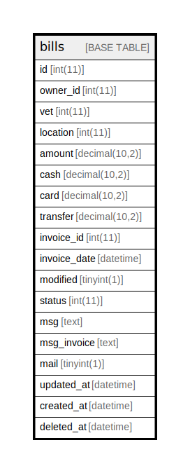

# bills

## Description

<details>
<summary><strong>Table Definition</strong></summary>

```sql
CREATE TABLE `bills` (
  `id` int(11) NOT NULL AUTO_INCREMENT,
  `owner_id` int(11) NOT NULL,
  `vet` int(11) NOT NULL,
  `location` int(11) NOT NULL,
  `amount` decimal(10,2) DEFAULT NULL,
  `cash` decimal(10,2) DEFAULT NULL,
  `card` decimal(10,2) DEFAULT NULL,
  `transfer` decimal(10,2) NOT NULL,
  `invoice_id` int(11) DEFAULT NULL,
  `invoice_date` datetime DEFAULT NULL,
  `modified` tinyint(1) NOT NULL DEFAULT 0 COMMENT 'yes/no value indication if price was manually modified',
  `status` int(11) NOT NULL COMMENT 'PAYMENT_* constant values',
  `msg` text NOT NULL,
  `msg_invoice` text NOT NULL,
  `mail` tinyint(1) NOT NULL,
  `updated_at` datetime DEFAULT NULL,
  `created_at` datetime DEFAULT NULL,
  `deleted_at` datetime DEFAULT NULL,
  PRIMARY KEY (`id`),
  KEY `owner_id` (`owner_id`)
) ENGINE=InnoDB AUTO_INCREMENT=[Redacted by tbls] DEFAULT CHARSET=latin1 COLLATE=latin1_swedish_ci
```

</details>

## Columns

| Name | Type | Default | Nullable | Extra Definition | Children | Parents | Comment |
| ---- | ---- | ------- | -------- | ---------------- | -------- | ------- | ------- |
| id | int(11) |  | false | auto_increment |  |  |  |
| owner_id | int(11) |  | false |  |  |  |  |
| vet | int(11) |  | false |  |  |  |  |
| location | int(11) |  | false |  |  |  |  |
| amount | decimal(10,2) | NULL | true |  |  |  |  |
| cash | decimal(10,2) | NULL | true |  |  |  |  |
| card | decimal(10,2) | NULL | true |  |  |  |  |
| transfer | decimal(10,2) |  | false |  |  |  |  |
| invoice_id | int(11) | NULL | true |  |  |  |  |
| invoice_date | datetime | NULL | true |  |  |  |  |
| modified | tinyint(1) | 0 | false |  |  |  | yes/no value indication if price was manually modified |
| status | int(11) |  | false |  |  |  | PAYMENT_* constant values |
| msg | text |  | false |  |  |  |  |
| msg_invoice | text |  | false |  |  |  |  |
| mail | tinyint(1) |  | false |  |  |  |  |
| updated_at | datetime | NULL | true |  |  |  |  |
| created_at | datetime | NULL | true |  |  |  |  |
| deleted_at | datetime | NULL | true |  |  |  |  |

## Constraints

| Name | Type | Definition |
| ---- | ---- | ---------- |
| PRIMARY | PRIMARY KEY | PRIMARY KEY (id) |

## Indexes

| Name | Definition |
| ---- | ---------- |
| owner_id | KEY owner_id (owner_id) USING BTREE |
| PRIMARY | PRIMARY KEY (id) USING BTREE |

## Relations



---

> Generated by [tbls](https://github.com/k1LoW/tbls)
