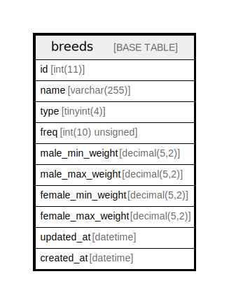

# breeds

## Description

<details>
<summary><strong>Table Definition</strong></summary>

```sql
CREATE TABLE `breeds` (
  `id` int(11) NOT NULL AUTO_INCREMENT,
  `name` varchar(255) CHARACTER SET utf8mb3 COLLATE utf8mb3_general_ci NOT NULL,
  `type` tinyint(4) DEFAULT -1,
  `freq` int(10) unsigned NOT NULL,
  `male_min_weight` decimal(5,2) NOT NULL,
  `male_max_weight` decimal(5,2) NOT NULL,
  `female_min_weight` decimal(5,2) NOT NULL,
  `female_max_weight` decimal(5,2) NOT NULL,
  `updated_at` datetime DEFAULT NULL,
  `created_at` datetime DEFAULT NULL,
  PRIMARY KEY (`id`)
) ENGINE=InnoDB AUTO_INCREMENT=[Redacted by tbls] DEFAULT CHARSET=latin1 COLLATE=latin1_swedish_ci
```

</details>

## Columns

| Name | Type | Default | Nullable | Extra Definition | Children | Parents | Comment |
| ---- | ---- | ------- | -------- | ---------------- | -------- | ------- | ------- |
| id | int(11) |  | false | auto_increment |  |  |  |
| name | varchar(255) |  | false |  |  |  |  |
| type | tinyint(4) | -1 | true |  |  |  |  |
| freq | int(10) unsigned |  | false |  |  |  |  |
| male_min_weight | decimal(5,2) |  | false |  |  |  |  |
| male_max_weight | decimal(5,2) |  | false |  |  |  |  |
| female_min_weight | decimal(5,2) |  | false |  |  |  |  |
| female_max_weight | decimal(5,2) |  | false |  |  |  |  |
| updated_at | datetime | NULL | true |  |  |  |  |
| created_at | datetime | NULL | true |  |  |  |  |

## Constraints

| Name | Type | Definition |
| ---- | ---- | ---------- |
| PRIMARY | PRIMARY KEY | PRIMARY KEY (id) |

## Indexes

| Name | Definition |
| ---- | ---------- |
| PRIMARY | PRIMARY KEY (id) USING BTREE |

## Relations



---

> Generated by [tbls](https://github.com/k1LoW/tbls)
