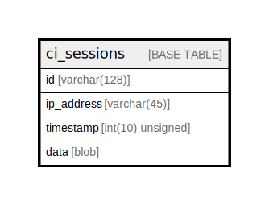

# ci_sessions

## Description

<details>
<summary><strong>Table Definition</strong></summary>

```sql
CREATE TABLE `ci_sessions` (
  `id` varchar(128) NOT NULL,
  `ip_address` varchar(45) NOT NULL,
  `timestamp` int(10) unsigned NOT NULL DEFAULT 0,
  `data` blob NOT NULL,
  KEY `ci_sessions_timestamp` (`timestamp`)
) ENGINE=MyISAM DEFAULT CHARSET=latin1 COLLATE=latin1_swedish_ci
```

</details>

## Columns

| Name | Type | Default | Nullable | Children | Parents | Comment |
| ---- | ---- | ------- | -------- | -------- | ------- | ------- |
| id | varchar(128) |  | false |  |  |  |
| ip_address | varchar(45) |  | false |  |  |  |
| timestamp | int(10) unsigned | 0 | false |  |  |  |
| data | blob |  | false |  |  |  |

## Indexes

| Name | Definition |
| ---- | ---------- |
| ci_sessions_timestamp | KEY ci_sessions_timestamp (timestamp) USING BTREE |

## Relations



---

> Generated by [tbls](https://github.com/k1LoW/tbls)
