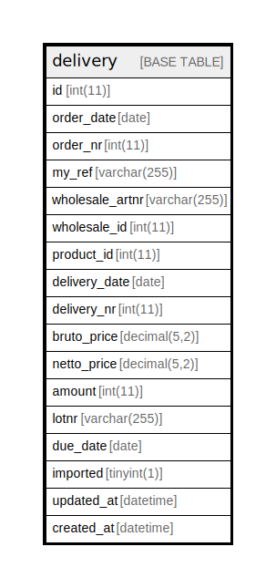

# delivery

## Description

<details>
<summary><strong>Table Definition</strong></summary>

```sql
CREATE TABLE `delivery` (
  `id` int(11) NOT NULL AUTO_INCREMENT,
  `order_date` date NOT NULL,
  `order_nr` int(11) NOT NULL,
  `my_ref` varchar(255) NOT NULL,
  `wholesale_artnr` varchar(255) NOT NULL,
  `wholesale_id` int(11) NOT NULL,
  `product_id` int(11) NOT NULL,
  `delivery_date` date NOT NULL,
  `delivery_nr` int(11) NOT NULL,
  `bruto_price` decimal(5,2) NOT NULL,
  `netto_price` decimal(5,2) NOT NULL,
  `amount` int(11) NOT NULL,
  `lotnr` varchar(255) NOT NULL,
  `due_date` date NOT NULL,
  `imported` tinyint(1) NOT NULL DEFAULT 0,
  `updated_at` datetime DEFAULT NULL,
  `created_at` datetime DEFAULT NULL,
  PRIMARY KEY (`id`),
  UNIQUE KEY `order_nr` (`order_nr`,`wholesale_artnr`,`delivery_nr`,`lotnr`,`due_date`)
) ENGINE=InnoDB DEFAULT CHARSET=utf8mb4 COLLATE=utf8mb4_general_ci
```

</details>

## Columns

| Name | Type | Default | Nullable | Extra Definition | Children | Parents | Comment |
| ---- | ---- | ------- | -------- | ---------------- | -------- | ------- | ------- |
| id | int(11) |  | false | auto_increment |  |  |  |
| order_date | date |  | false |  |  |  |  |
| order_nr | int(11) |  | false |  |  |  |  |
| my_ref | varchar(255) |  | false |  |  |  |  |
| wholesale_artnr | varchar(255) |  | false |  |  |  |  |
| wholesale_id | int(11) |  | false |  |  |  |  |
| product_id | int(11) |  | false |  |  |  |  |
| delivery_date | date |  | false |  |  |  |  |
| delivery_nr | int(11) |  | false |  |  |  |  |
| bruto_price | decimal(5,2) |  | false |  |  |  |  |
| netto_price | decimal(5,2) |  | false |  |  |  |  |
| amount | int(11) |  | false |  |  |  |  |
| lotnr | varchar(255) |  | false |  |  |  |  |
| due_date | date |  | false |  |  |  |  |
| imported | tinyint(1) | 0 | false |  |  |  |  |
| updated_at | datetime | NULL | true |  |  |  |  |
| created_at | datetime | NULL | true |  |  |  |  |

## Constraints

| Name | Type | Definition |
| ---- | ---- | ---------- |
| order_nr | UNIQUE | UNIQUE KEY order_nr (order_nr, wholesale_artnr, delivery_nr, lotnr, due_date) |
| PRIMARY | PRIMARY KEY | PRIMARY KEY (id) |

## Indexes

| Name | Definition |
| ---- | ---------- |
| PRIMARY | PRIMARY KEY (id) USING BTREE |
| order_nr | UNIQUE KEY order_nr (order_nr, wholesale_artnr, delivery_nr, lotnr, due_date) USING BTREE |

## Relations



---

> Generated by [tbls](https://github.com/k1LoW/tbls)
