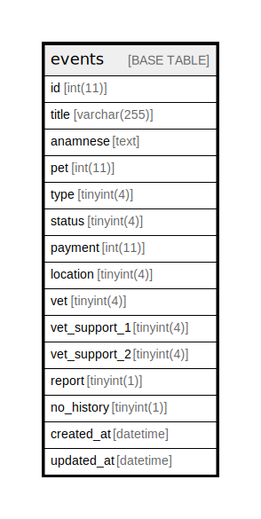

# events

## Description

<details>
<summary><strong>Table Definition</strong></summary>

```sql
CREATE TABLE `events` (
  `id` int(11) NOT NULL AUTO_INCREMENT,
  `title` varchar(255) NOT NULL,
  `anamnese` text NOT NULL,
  `pet` int(11) NOT NULL,
  `type` tinyint(4) NOT NULL,
  `status` tinyint(4) NOT NULL,
  `payment` int(11) NOT NULL,
  `location` tinyint(4) NOT NULL,
  `vet` tinyint(4) NOT NULL,
  `vet_support_1` tinyint(4) NOT NULL,
  `vet_support_2` tinyint(4) NOT NULL,
  `report` tinyint(1) NOT NULL DEFAULT 0,
  `no_history` tinyint(1) NOT NULL,
  `created_at` datetime NOT NULL DEFAULT current_timestamp(),
  `updated_at` datetime NOT NULL DEFAULT current_timestamp(),
  PRIMARY KEY (`id`),
  KEY `payment` (`payment`),
  KEY `pet` (`pet`),
  KEY `vet` (`vet`)
) ENGINE=InnoDB AUTO_INCREMENT=[Redacted by tbls] DEFAULT CHARSET=latin1 COLLATE=latin1_swedish_ci
```

</details>

## Columns

| Name | Type | Default | Nullable | Extra Definition | Children | Parents | Comment |
| ---- | ---- | ------- | -------- | ---------------- | -------- | ------- | ------- |
| id | int(11) |  | false | auto_increment |  |  |  |
| title | varchar(255) |  | false |  |  |  |  |
| anamnese | text |  | false |  |  |  |  |
| pet | int(11) |  | false |  |  |  |  |
| type | tinyint(4) |  | false |  |  |  |  |
| status | tinyint(4) |  | false |  |  |  |  |
| payment | int(11) |  | false |  |  |  |  |
| location | tinyint(4) |  | false |  |  |  |  |
| vet | tinyint(4) |  | false |  |  |  |  |
| vet_support_1 | tinyint(4) |  | false |  |  |  |  |
| vet_support_2 | tinyint(4) |  | false |  |  |  |  |
| report | tinyint(1) | 0 | false |  |  |  |  |
| no_history | tinyint(1) |  | false |  |  |  |  |
| created_at | datetime | current_timestamp() | false |  |  |  |  |
| updated_at | datetime | current_timestamp() | false |  |  |  |  |

## Constraints

| Name | Type | Definition |
| ---- | ---- | ---------- |
| PRIMARY | PRIMARY KEY | PRIMARY KEY (id) |

## Indexes

| Name | Definition |
| ---- | ---------- |
| payment | KEY payment (payment) USING BTREE |
| pet | KEY pet (pet) USING BTREE |
| vet | KEY vet (vet) USING BTREE |
| PRIMARY | PRIMARY KEY (id) USING BTREE |

## Relations



---

> Generated by [tbls](https://github.com/k1LoW/tbls)
