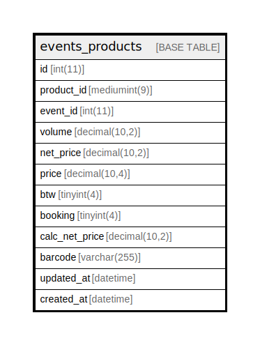

# events_products

## Description

<details>
<summary><strong>Table Definition</strong></summary>

```sql
CREATE TABLE `events_products` (
  `id` int(11) NOT NULL AUTO_INCREMENT,
  `product_id` mediumint(9) NOT NULL,
  `event_id` int(11) NOT NULL,
  `volume` decimal(10,2) NOT NULL,
  `net_price` decimal(10,2) NOT NULL,
  `price` decimal(10,4) NOT NULL,
  `btw` tinyint(4) NOT NULL,
  `booking` tinyint(4) NOT NULL,
  `calc_net_price` decimal(10,2) NOT NULL,
  `barcode` varchar(255) NOT NULL,
  `updated_at` datetime DEFAULT NULL,
  `created_at` datetime DEFAULT NULL,
  PRIMARY KEY (`id`),
  KEY `event_id` (`event_id`),
  KEY `product_id` (`product_id`)
) ENGINE=InnoDB AUTO_INCREMENT=[Redacted by tbls] DEFAULT CHARSET=latin1 COLLATE=latin1_swedish_ci
```

</details>

## Columns

| Name | Type | Default | Nullable | Extra Definition | Children | Parents | Comment |
| ---- | ---- | ------- | -------- | ---------------- | -------- | ------- | ------- |
| id | int(11) |  | false | auto_increment |  |  |  |
| product_id | mediumint(9) |  | false |  |  |  |  |
| event_id | int(11) |  | false |  |  |  |  |
| volume | decimal(10,2) |  | false |  |  |  |  |
| net_price | decimal(10,2) |  | false |  |  |  |  |
| price | decimal(10,4) |  | false |  |  |  |  |
| btw | tinyint(4) |  | false |  |  |  |  |
| booking | tinyint(4) |  | false |  |  |  |  |
| calc_net_price | decimal(10,2) |  | false |  |  |  |  |
| barcode | varchar(255) |  | false |  |  |  |  |
| updated_at | datetime | NULL | true |  |  |  |  |
| created_at | datetime | NULL | true |  |  |  |  |

## Constraints

| Name | Type | Definition |
| ---- | ---- | ---------- |
| PRIMARY | PRIMARY KEY | PRIMARY KEY (id) |

## Indexes

| Name | Definition |
| ---- | ---------- |
| event_id | KEY event_id (event_id) USING BTREE |
| product_id | KEY product_id (product_id) USING BTREE |
| PRIMARY | PRIMARY KEY (id) USING BTREE |

## Relations



---

> Generated by [tbls](https://github.com/k1LoW/tbls)
