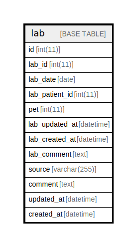

# lab

## Description

<details>
<summary><strong>Table Definition</strong></summary>

```sql
CREATE TABLE `lab` (
  `id` int(11) NOT NULL AUTO_INCREMENT,
  `lab_id` int(11) NOT NULL,
  `lab_date` date DEFAULT NULL,
  `lab_patient_id` int(11) DEFAULT NULL,
  `pet` int(11) DEFAULT NULL,
  `lab_updated_at` datetime DEFAULT NULL,
  `lab_created_at` datetime DEFAULT NULL,
  `lab_comment` text NOT NULL,
  `source` varchar(255) NOT NULL,
  `comment` text NOT NULL,
  `updated_at` datetime DEFAULT NULL,
  `created_at` datetime DEFAULT NULL,
  PRIMARY KEY (`id`),
  UNIQUE KEY `lab_id` (`lab_id`)
) ENGINE=InnoDB AUTO_INCREMENT=[Redacted by tbls] DEFAULT CHARSET=utf8mb4 COLLATE=utf8mb4_general_ci
```

</details>

## Columns

| Name | Type | Default | Nullable | Extra Definition | Children | Parents | Comment |
| ---- | ---- | ------- | -------- | ---------------- | -------- | ------- | ------- |
| id | int(11) |  | false | auto_increment |  |  |  |
| lab_id | int(11) |  | false |  |  |  |  |
| lab_date | date | NULL | true |  |  |  |  |
| lab_patient_id | int(11) | NULL | true |  |  |  |  |
| pet | int(11) | NULL | true |  |  |  |  |
| lab_updated_at | datetime | NULL | true |  |  |  |  |
| lab_created_at | datetime | NULL | true |  |  |  |  |
| lab_comment | text |  | false |  |  |  |  |
| source | varchar(255) |  | false |  |  |  |  |
| comment | text |  | false |  |  |  |  |
| updated_at | datetime | NULL | true |  |  |  |  |
| created_at | datetime | NULL | true |  |  |  |  |

## Constraints

| Name | Type | Definition |
| ---- | ---- | ---------- |
| lab_id | UNIQUE | UNIQUE KEY lab_id (lab_id) |
| PRIMARY | PRIMARY KEY | PRIMARY KEY (id) |

## Indexes

| Name | Definition |
| ---- | ---------- |
| PRIMARY | PRIMARY KEY (id) USING BTREE |
| lab_id | UNIQUE KEY lab_id (lab_id) USING BTREE |

## Relations



---

> Generated by [tbls](https://github.com/k1LoW/tbls)
