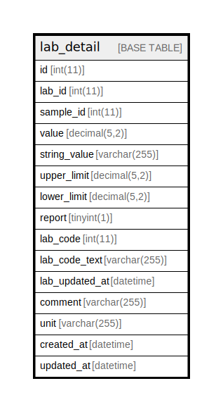

# lab_detail

## Description

<details>
<summary><strong>Table Definition</strong></summary>

```sql
CREATE TABLE `lab_detail` (
  `id` int(11) NOT NULL AUTO_INCREMENT,
  `lab_id` int(11) NOT NULL,
  `sample_id` int(11) NOT NULL,
  `value` decimal(5,2) NOT NULL,
  `string_value` varchar(255) NOT NULL,
  `upper_limit` decimal(5,2) NOT NULL,
  `lower_limit` decimal(5,2) NOT NULL,
  `report` tinyint(1) NOT NULL,
  `lab_code` int(11) NOT NULL,
  `lab_code_text` varchar(255) NOT NULL,
  `lab_updated_at` datetime DEFAULT NULL,
  `comment` varchar(255) NOT NULL,
  `unit` varchar(255) NOT NULL,
  `created_at` datetime DEFAULT NULL,
  `updated_at` datetime DEFAULT NULL,
  PRIMARY KEY (`id`),
  UNIQUE KEY `sample_id` (`sample_id`,`lab_code`),
  KEY `lab_id` (`lab_id`)
) ENGINE=InnoDB AUTO_INCREMENT=[Redacted by tbls] DEFAULT CHARSET=utf8mb4 COLLATE=utf8mb4_general_ci
```

</details>

## Columns

| Name | Type | Default | Nullable | Extra Definition | Children | Parents | Comment |
| ---- | ---- | ------- | -------- | ---------------- | -------- | ------- | ------- |
| id | int(11) |  | false | auto_increment |  |  |  |
| lab_id | int(11) |  | false |  |  |  |  |
| sample_id | int(11) |  | false |  |  |  |  |
| value | decimal(5,2) |  | false |  |  |  |  |
| string_value | varchar(255) |  | false |  |  |  |  |
| upper_limit | decimal(5,2) |  | false |  |  |  |  |
| lower_limit | decimal(5,2) |  | false |  |  |  |  |
| report | tinyint(1) |  | false |  |  |  |  |
| lab_code | int(11) |  | false |  |  |  |  |
| lab_code_text | varchar(255) |  | false |  |  |  |  |
| lab_updated_at | datetime | NULL | true |  |  |  |  |
| comment | varchar(255) |  | false |  |  |  |  |
| unit | varchar(255) |  | false |  |  |  |  |
| created_at | datetime | NULL | true |  |  |  |  |
| updated_at | datetime | NULL | true |  |  |  |  |

## Constraints

| Name | Type | Definition |
| ---- | ---- | ---------- |
| PRIMARY | PRIMARY KEY | PRIMARY KEY (id) |
| sample_id | UNIQUE | UNIQUE KEY sample_id (sample_id, lab_code) |

## Indexes

| Name | Definition |
| ---- | ---------- |
| lab_id | KEY lab_id (lab_id) USING BTREE |
| PRIMARY | PRIMARY KEY (id) USING BTREE |
| sample_id | UNIQUE KEY sample_id (sample_id, lab_code) USING BTREE |

## Relations



---

> Generated by [tbls](https://github.com/k1LoW/tbls)
