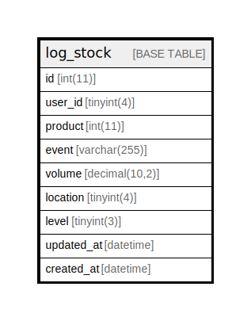

# log_stock

## Description

<details>
<summary><strong>Table Definition</strong></summary>

```sql
CREATE TABLE `log_stock` (
  `id` int(11) NOT NULL,
  `user_id` tinyint(4) NOT NULL,
  `product` int(11) NOT NULL,
  `event` varchar(255) NOT NULL,
  `volume` decimal(10,2) NOT NULL,
  `location` tinyint(4) NOT NULL,
  `level` tinyint(3) NOT NULL,
  `updated_at` datetime NOT NULL DEFAULT current_timestamp(),
  `created_at` datetime NOT NULL DEFAULT current_timestamp()
) ENGINE=InnoDB DEFAULT CHARSET=utf8mb4 COLLATE=utf8mb4_general_ci
```

</details>

## Columns

| Name | Type | Default | Nullable | Children | Parents | Comment |
| ---- | ---- | ------- | -------- | -------- | ------- | ------- |
| id | int(11) |  | false |  |  |  |
| user_id | tinyint(4) |  | false |  |  |  |
| product | int(11) |  | false |  |  |  |
| event | varchar(255) |  | false |  |  |  |
| volume | decimal(10,2) |  | false |  |  |  |
| location | tinyint(4) |  | false |  |  |  |
| level | tinyint(3) |  | false |  |  |  |
| updated_at | datetime | current_timestamp() | false |  |  |  |
| created_at | datetime | current_timestamp() | false |  |  |  |

## Relations



---

> Generated by [tbls](https://github.com/k1LoW/tbls)
