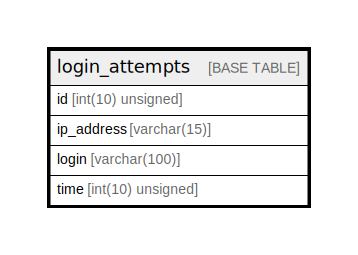

# login_attempts

## Description

<details>
<summary><strong>Table Definition</strong></summary>

```sql
CREATE TABLE `login_attempts` (
  `id` int(10) unsigned NOT NULL AUTO_INCREMENT,
  `ip_address` varchar(15) NOT NULL,
  `login` varchar(100) NOT NULL,
  `time` int(10) unsigned DEFAULT NULL,
  PRIMARY KEY (`id`)
) ENGINE=InnoDB AUTO_INCREMENT=[Redacted by tbls] DEFAULT CHARSET=utf8mb3 COLLATE=utf8mb3_general_ci
```

</details>

## Columns

| Name | Type | Default | Nullable | Extra Definition | Children | Parents | Comment |
| ---- | ---- | ------- | -------- | ---------------- | -------- | ------- | ------- |
| id | int(10) unsigned |  | false | auto_increment |  |  |  |
| ip_address | varchar(15) |  | false |  |  |  |  |
| login | varchar(100) |  | false |  |  |  |  |
| time | int(10) unsigned | NULL | true |  |  |  |  |

## Constraints

| Name | Type | Definition |
| ---- | ---- | ---------- |
| PRIMARY | PRIMARY KEY | PRIMARY KEY (id) |

## Indexes

| Name | Definition |
| ---- | ---------- |
| PRIMARY | PRIMARY KEY (id) USING BTREE |

## Relations



---

> Generated by [tbls](https://github.com/k1LoW/tbls)
