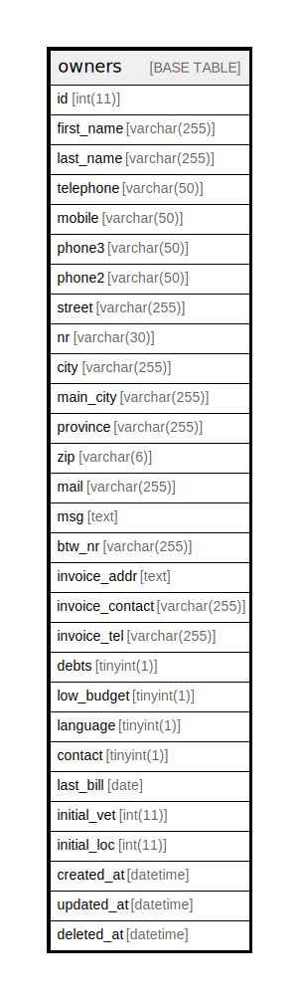

# owners

## Description

<details>
<summary><strong>Table Definition</strong></summary>

```sql
CREATE TABLE `owners` (
  `id` int(11) NOT NULL AUTO_INCREMENT,
  `first_name` varchar(255) NOT NULL,
  `last_name` varchar(255) NOT NULL,
  `telephone` varchar(50) DEFAULT NULL,
  `mobile` varchar(50) DEFAULT NULL,
  `phone3` varchar(50) NOT NULL,
  `phone2` varchar(50) NOT NULL,
  `street` varchar(255) NOT NULL,
  `nr` varchar(30) NOT NULL,
  `city` varchar(255) NOT NULL,
  `main_city` varchar(255) NOT NULL,
  `province` varchar(255) NOT NULL,
  `zip` varchar(6) NOT NULL,
  `mail` varchar(255) DEFAULT NULL,
  `msg` text NOT NULL,
  `btw_nr` varchar(255) DEFAULT NULL,
  `invoice_addr` text DEFAULT NULL,
  `invoice_contact` varchar(255) DEFAULT NULL,
  `invoice_tel` varchar(255) DEFAULT NULL,
  `debts` tinyint(1) DEFAULT NULL,
  `low_budget` tinyint(1) NOT NULL,
  `language` tinyint(1) NOT NULL,
  `contact` tinyint(1) NOT NULL,
  `last_bill` date DEFAULT NULL,
  `initial_vet` int(11) NOT NULL,
  `initial_loc` int(11) NOT NULL,
  `created_at` datetime DEFAULT NULL,
  `updated_at` datetime DEFAULT NULL,
  `deleted_at` datetime DEFAULT NULL,
  PRIMARY KEY (`id`),
  KEY `telephone` (`telephone`),
  KEY `mobile` (`mobile`),
  KEY `street` (`street`),
  KEY `first_name` (`first_name`),
  KEY `last_name` (`last_name`)
) ENGINE=InnoDB AUTO_INCREMENT=[Redacted by tbls] DEFAULT CHARSET=latin1 COLLATE=latin1_swedish_ci
```

</details>

## Columns

| Name | Type | Default | Nullable | Extra Definition | Children | Parents | Comment |
| ---- | ---- | ------- | -------- | ---------------- | -------- | ------- | ------- |
| id | int(11) |  | false | auto_increment |  |  |  |
| first_name | varchar(255) |  | false |  |  |  |  |
| last_name | varchar(255) |  | false |  |  |  |  |
| telephone | varchar(50) | NULL | true |  |  |  |  |
| mobile | varchar(50) | NULL | true |  |  |  |  |
| phone3 | varchar(50) |  | false |  |  |  |  |
| phone2 | varchar(50) |  | false |  |  |  |  |
| street | varchar(255) |  | false |  |  |  |  |
| nr | varchar(30) |  | false |  |  |  |  |
| city | varchar(255) |  | false |  |  |  |  |
| main_city | varchar(255) |  | false |  |  |  |  |
| province | varchar(255) |  | false |  |  |  |  |
| zip | varchar(6) |  | false |  |  |  |  |
| mail | varchar(255) | NULL | true |  |  |  |  |
| msg | text |  | false |  |  |  |  |
| btw_nr | varchar(255) | NULL | true |  |  |  |  |
| invoice_addr | text | NULL | true |  |  |  |  |
| invoice_contact | varchar(255) | NULL | true |  |  |  |  |
| invoice_tel | varchar(255) | NULL | true |  |  |  |  |
| debts | tinyint(1) | NULL | true |  |  |  |  |
| low_budget | tinyint(1) |  | false |  |  |  |  |
| language | tinyint(1) |  | false |  |  |  |  |
| contact | tinyint(1) |  | false |  |  |  |  |
| last_bill | date | NULL | true |  |  |  |  |
| initial_vet | int(11) |  | false |  |  |  |  |
| initial_loc | int(11) |  | false |  |  |  |  |
| created_at | datetime | NULL | true |  |  |  |  |
| updated_at | datetime | NULL | true |  |  |  |  |
| deleted_at | datetime | NULL | true |  |  |  |  |

## Constraints

| Name | Type | Definition |
| ---- | ---- | ---------- |
| PRIMARY | PRIMARY KEY | PRIMARY KEY (id) |

## Indexes

| Name | Definition |
| ---- | ---------- |
| first_name | KEY first_name (first_name) USING BTREE |
| last_name | KEY last_name (last_name) USING BTREE |
| mobile | KEY mobile (mobile) USING BTREE |
| street | KEY street (street) USING BTREE |
| telephone | KEY telephone (telephone) USING BTREE |
| PRIMARY | PRIMARY KEY (id) USING BTREE |

## Relations



---

> Generated by [tbls](https://github.com/k1LoW/tbls)
