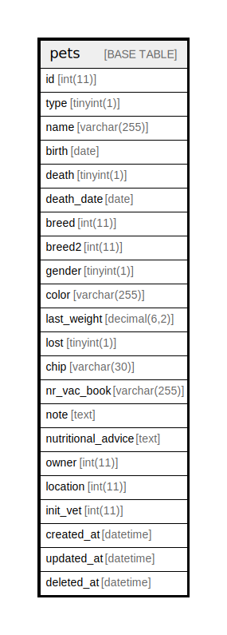

# pets

## Description

<details>
<summary><strong>Table Definition</strong></summary>

```sql
CREATE TABLE `pets` (
  `id` int(11) NOT NULL AUTO_INCREMENT,
  `type` tinyint(1) NOT NULL,
  `name` varchar(255) NOT NULL,
  `birth` date DEFAULT NULL,
  `death` tinyint(1) NOT NULL,
  `death_date` date DEFAULT NULL,
  `breed` int(11) NOT NULL DEFAULT 0,
  `breed2` int(11) DEFAULT NULL,
  `gender` tinyint(1) NOT NULL,
  `color` varchar(255) NOT NULL,
  `last_weight` decimal(6,2) NOT NULL,
  `lost` tinyint(1) NOT NULL,
  `chip` varchar(30) NOT NULL,
  `nr_vac_book` varchar(255) NOT NULL,
  `note` text NOT NULL,
  `nutritional_advice` text NOT NULL,
  `owner` int(11) NOT NULL,
  `location` int(11) NOT NULL,
  `init_vet` int(11) NOT NULL,
  `created_at` datetime DEFAULT NULL,
  `updated_at` datetime DEFAULT NULL,
  `deleted_at` datetime DEFAULT NULL,
  PRIMARY KEY (`id`),
  KEY `owner` (`owner`),
  KEY `death` (`death`)
) ENGINE=InnoDB AUTO_INCREMENT=[Redacted by tbls] DEFAULT CHARSET=latin1 COLLATE=latin1_swedish_ci
```

</details>

## Columns

| Name | Type | Default | Nullable | Extra Definition | Children | Parents | Comment |
| ---- | ---- | ------- | -------- | ---------------- | -------- | ------- | ------- |
| id | int(11) |  | false | auto_increment |  |  |  |
| type | tinyint(1) |  | false |  |  |  |  |
| name | varchar(255) |  | false |  |  |  |  |
| birth | date | NULL | true |  |  |  |  |
| death | tinyint(1) |  | false |  |  |  |  |
| death_date | date | NULL | true |  |  |  |  |
| breed | int(11) | 0 | false |  |  |  |  |
| breed2 | int(11) | NULL | true |  |  |  |  |
| gender | tinyint(1) |  | false |  |  |  |  |
| color | varchar(255) |  | false |  |  |  |  |
| last_weight | decimal(6,2) |  | false |  |  |  |  |
| lost | tinyint(1) |  | false |  |  |  |  |
| chip | varchar(30) |  | false |  |  |  |  |
| nr_vac_book | varchar(255) |  | false |  |  |  |  |
| note | text |  | false |  |  |  |  |
| nutritional_advice | text |  | false |  |  |  |  |
| owner | int(11) |  | false |  |  |  |  |
| location | int(11) |  | false |  |  |  |  |
| init_vet | int(11) |  | false |  |  |  |  |
| created_at | datetime | NULL | true |  |  |  |  |
| updated_at | datetime | NULL | true |  |  |  |  |
| deleted_at | datetime | NULL | true |  |  |  |  |

## Constraints

| Name | Type | Definition |
| ---- | ---- | ---------- |
| PRIMARY | PRIMARY KEY | PRIMARY KEY (id) |

## Indexes

| Name | Definition |
| ---- | ---------- |
| death | KEY death (death) USING BTREE |
| owner | KEY owner (owner) USING BTREE |
| PRIMARY | PRIMARY KEY (id) USING BTREE |

## Relations



---

> Generated by [tbls](https://github.com/k1LoW/tbls)
