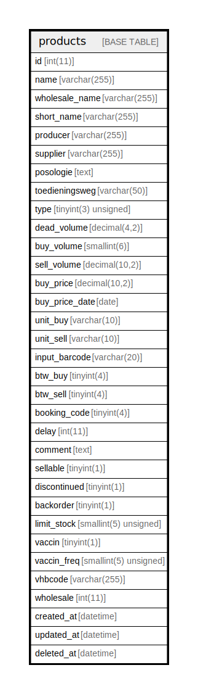

# products

## Description

<details>
<summary><strong>Table Definition</strong></summary>

```sql
CREATE TABLE `products` (
  `id` int(11) NOT NULL AUTO_INCREMENT,
  `name` varchar(255) CHARACTER SET utf8mb4 COLLATE utf8mb4_unicode_520_ci NOT NULL,
  `wholesale_name` varchar(255) NOT NULL,
  `short_name` varchar(255) NOT NULL,
  `producer` varchar(255) NOT NULL,
  `supplier` varchar(255) NOT NULL,
  `posologie` text NOT NULL,
  `toedieningsweg` varchar(50) NOT NULL,
  `type` tinyint(3) unsigned NOT NULL,
  `dead_volume` decimal(4,2) DEFAULT NULL,
  `buy_volume` smallint(6) NOT NULL,
  `sell_volume` decimal(10,2) NOT NULL,
  `buy_price` decimal(10,2) NOT NULL,
  `buy_price_date` date DEFAULT NULL,
  `unit_buy` varchar(10) NOT NULL,
  `unit_sell` varchar(10) NOT NULL,
  `input_barcode` varchar(20) DEFAULT NULL,
  `btw_buy` tinyint(4) NOT NULL,
  `btw_sell` tinyint(4) NOT NULL,
  `booking_code` tinyint(4) NOT NULL,
  `delay` int(11) NOT NULL,
  `comment` text NOT NULL,
  `sellable` tinyint(1) NOT NULL,
  `discontinued` tinyint(1) NOT NULL DEFAULT 0,
  `backorder` tinyint(1) NOT NULL,
  `limit_stock` smallint(5) unsigned NOT NULL,
  `vaccin` tinyint(1) NOT NULL DEFAULT 0,
  `vaccin_freq` smallint(5) unsigned NOT NULL,
  `vhbcode` varchar(255) NOT NULL,
  `wholesale` int(11) NOT NULL,
  `created_at` datetime DEFAULT NULL,
  `updated_at` datetime DEFAULT NULL,
  `deleted_at` datetime DEFAULT NULL,
  PRIMARY KEY (`id`),
  UNIQUE KEY `barcode` (`input_barcode`),
  KEY `name` (`name`),
  KEY `wholesale` (`wholesale`)
) ENGINE=InnoDB AUTO_INCREMENT=[Redacted by tbls] DEFAULT CHARSET=latin1 COLLATE=latin1_swedish_ci
```

</details>

## Columns

| Name | Type | Default | Nullable | Extra Definition | Children | Parents | Comment |
| ---- | ---- | ------- | -------- | ---------------- | -------- | ------- | ------- |
| id | int(11) |  | false | auto_increment |  |  |  |
| name | varchar(255) |  | false |  |  |  |  |
| wholesale_name | varchar(255) |  | false |  |  |  |  |
| short_name | varchar(255) |  | false |  |  |  |  |
| producer | varchar(255) |  | false |  |  |  |  |
| supplier | varchar(255) |  | false |  |  |  |  |
| posologie | text |  | false |  |  |  |  |
| toedieningsweg | varchar(50) |  | false |  |  |  |  |
| type | tinyint(3) unsigned |  | false |  |  |  |  |
| dead_volume | decimal(4,2) | NULL | true |  |  |  |  |
| buy_volume | smallint(6) |  | false |  |  |  |  |
| sell_volume | decimal(10,2) |  | false |  |  |  |  |
| buy_price | decimal(10,2) |  | false |  |  |  |  |
| buy_price_date | date | NULL | true |  |  |  |  |
| unit_buy | varchar(10) |  | false |  |  |  |  |
| unit_sell | varchar(10) |  | false |  |  |  |  |
| input_barcode | varchar(20) | NULL | true |  |  |  |  |
| btw_buy | tinyint(4) |  | false |  |  |  |  |
| btw_sell | tinyint(4) |  | false |  |  |  |  |
| booking_code | tinyint(4) |  | false |  |  |  |  |
| delay | int(11) |  | false |  |  |  |  |
| comment | text |  | false |  |  |  |  |
| sellable | tinyint(1) |  | false |  |  |  |  |
| discontinued | tinyint(1) | 0 | false |  |  |  |  |
| backorder | tinyint(1) |  | false |  |  |  |  |
| limit_stock | smallint(5) unsigned |  | false |  |  |  |  |
| vaccin | tinyint(1) | 0 | false |  |  |  |  |
| vaccin_freq | smallint(5) unsigned |  | false |  |  |  |  |
| vhbcode | varchar(255) |  | false |  |  |  |  |
| wholesale | int(11) |  | false |  |  |  |  |
| created_at | datetime | NULL | true |  |  |  |  |
| updated_at | datetime | NULL | true |  |  |  |  |
| deleted_at | datetime | NULL | true |  |  |  |  |

## Constraints

| Name | Type | Definition |
| ---- | ---- | ---------- |
| barcode | UNIQUE | UNIQUE KEY barcode (input_barcode) |
| PRIMARY | PRIMARY KEY | PRIMARY KEY (id) |

## Indexes

| Name | Definition |
| ---- | ---------- |
| name | KEY name (name) USING BTREE |
| wholesale | KEY wholesale (wholesale) USING BTREE |
| PRIMARY | PRIMARY KEY (id) USING BTREE |
| barcode | UNIQUE KEY barcode (input_barcode) USING BTREE |

## Relations



---

> Generated by [tbls](https://github.com/k1LoW/tbls)
