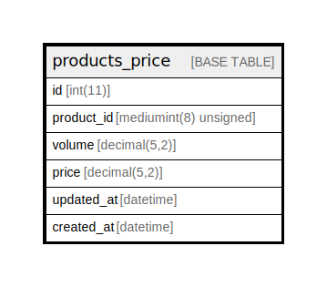

# products_price

## Description

<details>
<summary><strong>Table Definition</strong></summary>

```sql
CREATE TABLE `products_price` (
  `id` int(11) NOT NULL AUTO_INCREMENT,
  `product_id` mediumint(8) unsigned NOT NULL,
  `volume` decimal(5,2) NOT NULL,
  `price` decimal(5,2) NOT NULL,
  `updated_at` datetime DEFAULT NULL,
  `created_at` datetime DEFAULT NULL,
  PRIMARY KEY (`id`)
) ENGINE=InnoDB AUTO_INCREMENT=[Redacted by tbls] DEFAULT CHARSET=latin1 COLLATE=latin1_swedish_ci
```

</details>

## Columns

| Name | Type | Default | Nullable | Extra Definition | Children | Parents | Comment |
| ---- | ---- | ------- | -------- | ---------------- | -------- | ------- | ------- |
| id | int(11) |  | false | auto_increment |  |  |  |
| product_id | mediumint(8) unsigned |  | false |  |  |  |  |
| volume | decimal(5,2) |  | false |  |  |  |  |
| price | decimal(5,2) |  | false |  |  |  |  |
| updated_at | datetime | NULL | true |  |  |  |  |
| created_at | datetime | NULL | true |  |  |  |  |

## Constraints

| Name | Type | Definition |
| ---- | ---- | ---------- |
| PRIMARY | PRIMARY KEY | PRIMARY KEY (id) |

## Indexes

| Name | Definition |
| ---- | ---------- |
| PRIMARY | PRIMARY KEY (id) USING BTREE |

## Relations



---

> Generated by [tbls](https://github.com/k1LoW/tbls)
