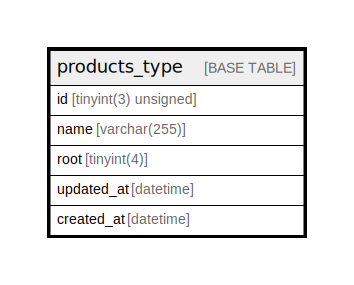

# products_type

## Description

<details>
<summary><strong>Table Definition</strong></summary>

```sql
CREATE TABLE `products_type` (
  `id` tinyint(3) unsigned NOT NULL AUTO_INCREMENT,
  `name` varchar(255) NOT NULL,
  `root` tinyint(4) DEFAULT NULL,
  `updated_at` datetime DEFAULT NULL,
  `created_at` datetime DEFAULT NULL,
  PRIMARY KEY (`id`)
) ENGINE=InnoDB AUTO_INCREMENT=[Redacted by tbls] DEFAULT CHARSET=latin1 COLLATE=latin1_swedish_ci
```

</details>

## Columns

| Name | Type | Default | Nullable | Extra Definition | Children | Parents | Comment |
| ---- | ---- | ------- | -------- | ---------------- | -------- | ------- | ------- |
| id | tinyint(3) unsigned |  | false | auto_increment |  |  |  |
| name | varchar(255) |  | false |  |  |  |  |
| root | tinyint(4) | NULL | true |  |  |  |  |
| updated_at | datetime | NULL | true |  |  |  |  |
| created_at | datetime | NULL | true |  |  |  |  |

## Constraints

| Name | Type | Definition |
| ---- | ---- | ---------- |
| PRIMARY | PRIMARY KEY | PRIMARY KEY (id) |

## Indexes

| Name | Definition |
| ---- | ---------- |
| PRIMARY | PRIMARY KEY (id) USING BTREE |

## Relations



---

> Generated by [tbls](https://github.com/k1LoW/tbls)
