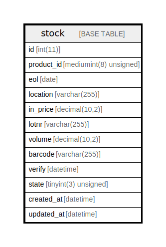

# stock

## Description

<details>
<summary><strong>Table Definition</strong></summary>

```sql
CREATE TABLE `stock` (
  `id` int(11) NOT NULL AUTO_INCREMENT,
  `product_id` mediumint(8) unsigned NOT NULL,
  `eol` date DEFAULT NULL,
  `location` varchar(255) NOT NULL,
  `in_price` decimal(10,2) NOT NULL,
  `lotnr` varchar(255) NOT NULL,
  `volume` decimal(10,2) NOT NULL,
  `barcode` varchar(255) NOT NULL,
  `verify` datetime DEFAULT NULL,
  `state` tinyint(3) unsigned NOT NULL,
  `created_at` datetime DEFAULT NULL,
  `updated_at` datetime DEFAULT NULL,
  PRIMARY KEY (`id`),
  KEY `product_id` (`product_id`),
  KEY `gsl_lookup` (`eol`,`location`,`lotnr`)
) ENGINE=InnoDB AUTO_INCREMENT=[Redacted by tbls] DEFAULT CHARSET=latin1 COLLATE=latin1_swedish_ci
```

</details>

## Columns

| Name | Type | Default | Nullable | Extra Definition | Children | Parents | Comment |
| ---- | ---- | ------- | -------- | ---------------- | -------- | ------- | ------- |
| id | int(11) |  | false | auto_increment |  |  |  |
| product_id | mediumint(8) unsigned |  | false |  |  |  |  |
| eol | date | NULL | true |  |  |  |  |
| location | varchar(255) |  | false |  |  |  |  |
| in_price | decimal(10,2) |  | false |  |  |  |  |
| lotnr | varchar(255) |  | false |  |  |  |  |
| volume | decimal(10,2) |  | false |  |  |  |  |
| barcode | varchar(255) |  | false |  |  |  |  |
| verify | datetime | NULL | true |  |  |  |  |
| state | tinyint(3) unsigned |  | false |  |  |  |  |
| created_at | datetime | NULL | true |  |  |  |  |
| updated_at | datetime | NULL | true |  |  |  |  |

## Constraints

| Name | Type | Definition |
| ---- | ---- | ---------- |
| PRIMARY | PRIMARY KEY | PRIMARY KEY (id) |

## Indexes

| Name | Definition |
| ---- | ---------- |
| gsl_lookup | KEY gsl_lookup (eol, location, lotnr) USING BTREE |
| product_id | KEY product_id (product_id) USING BTREE |
| PRIMARY | PRIMARY KEY (id) USING BTREE |

## Relations



---

> Generated by [tbls](https://github.com/k1LoW/tbls)
