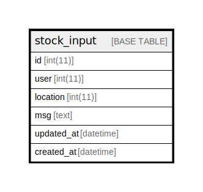

# stock_input

## Description

<details>
<summary><strong>Table Definition</strong></summary>

```sql
CREATE TABLE `stock_input` (
  `id` int(11) NOT NULL AUTO_INCREMENT,
  `user` int(11) NOT NULL,
  `location` int(11) NOT NULL,
  `msg` text NOT NULL,
  `updated_at` datetime NOT NULL,
  `created_at` datetime NOT NULL,
  PRIMARY KEY (`id`)
) ENGINE=InnoDB DEFAULT CHARSET=utf8mb4 COLLATE=utf8mb4_general_ci
```

</details>

## Columns

| Name | Type | Default | Nullable | Extra Definition | Children | Parents | Comment |
| ---- | ---- | ------- | -------- | ---------------- | -------- | ------- | ------- |
| id | int(11) |  | false | auto_increment |  |  |  |
| user | int(11) |  | false |  |  |  |  |
| location | int(11) |  | false |  |  |  |  |
| msg | text |  | false |  |  |  |  |
| updated_at | datetime |  | false |  |  |  |  |
| created_at | datetime |  | false |  |  |  |  |

## Constraints

| Name | Type | Definition |
| ---- | ---- | ---------- |
| PRIMARY | PRIMARY KEY | PRIMARY KEY (id) |

## Indexes

| Name | Definition |
| ---- | ---------- |
| PRIMARY | PRIMARY KEY (id) USING BTREE |

## Relations



---

> Generated by [tbls](https://github.com/k1LoW/tbls)
