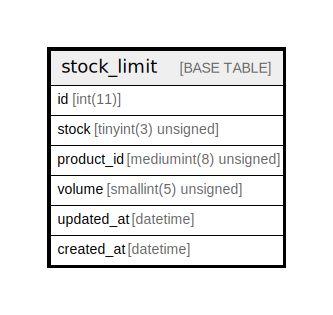

# stock_limit

## Description

<details>
<summary><strong>Table Definition</strong></summary>

```sql
CREATE TABLE `stock_limit` (
  `id` int(11) NOT NULL AUTO_INCREMENT,
  `stock` tinyint(3) unsigned NOT NULL,
  `product_id` mediumint(8) unsigned NOT NULL,
  `volume` smallint(5) unsigned NOT NULL,
  `updated_at` datetime DEFAULT NULL,
  `created_at` datetime DEFAULT NULL,
  PRIMARY KEY (`id`),
  UNIQUE KEY `stock` (`stock`,`product_id`)
) ENGINE=InnoDB AUTO_INCREMENT=[Redacted by tbls] DEFAULT CHARSET=latin1 COLLATE=latin1_swedish_ci
```

</details>

## Columns

| Name | Type | Default | Nullable | Extra Definition | Children | Parents | Comment |
| ---- | ---- | ------- | -------- | ---------------- | -------- | ------- | ------- |
| id | int(11) |  | false | auto_increment |  |  |  |
| stock | tinyint(3) unsigned |  | false |  |  |  |  |
| product_id | mediumint(8) unsigned |  | false |  |  |  |  |
| volume | smallint(5) unsigned |  | false |  |  |  |  |
| updated_at | datetime | NULL | true |  |  |  |  |
| created_at | datetime | NULL | true |  |  |  |  |

## Constraints

| Name | Type | Definition |
| ---- | ---- | ---------- |
| PRIMARY | PRIMARY KEY | PRIMARY KEY (id) |
| stock | UNIQUE | UNIQUE KEY stock (stock, product_id) |

## Indexes

| Name | Definition |
| ---- | ---------- |
| PRIMARY | PRIMARY KEY (id) USING BTREE |
| stock | UNIQUE KEY stock (stock, product_id) USING BTREE |

## Relations



---

> Generated by [tbls](https://github.com/k1LoW/tbls)
