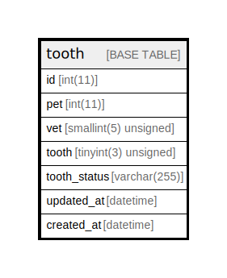

# tooth

## Description

<details>
<summary><strong>Table Definition</strong></summary>

```sql
CREATE TABLE `tooth` (
  `id` int(11) NOT NULL AUTO_INCREMENT,
  `pet` int(11) NOT NULL,
  `vet` smallint(5) unsigned NOT NULL,
  `tooth` tinyint(3) unsigned NOT NULL,
  `tooth_status` varchar(255) NOT NULL,
  `updated_at` datetime DEFAULT NULL,
  `created_at` datetime DEFAULT NULL,
  PRIMARY KEY (`id`),
  UNIQUE KEY `pet` (`pet`,`tooth`)
) ENGINE=InnoDB AUTO_INCREMENT=[Redacted by tbls] DEFAULT CHARSET=latin1 COLLATE=latin1_swedish_ci
```

</details>

## Columns

| Name | Type | Default | Nullable | Extra Definition | Children | Parents | Comment |
| ---- | ---- | ------- | -------- | ---------------- | -------- | ------- | ------- |
| id | int(11) |  | false | auto_increment |  |  |  |
| pet | int(11) |  | false |  |  |  |  |
| vet | smallint(5) unsigned |  | false |  |  |  |  |
| tooth | tinyint(3) unsigned |  | false |  |  |  |  |
| tooth_status | varchar(255) |  | false |  |  |  |  |
| updated_at | datetime | NULL | true |  |  |  |  |
| created_at | datetime | NULL | true |  |  |  |  |

## Constraints

| Name | Type | Definition |
| ---- | ---- | ---------- |
| pet | UNIQUE | UNIQUE KEY pet (pet, tooth) |
| PRIMARY | PRIMARY KEY | PRIMARY KEY (id) |

## Indexes

| Name | Definition |
| ---- | ---------- |
| PRIMARY | PRIMARY KEY (id) USING BTREE |
| pet | UNIQUE KEY pet (pet, tooth) USING BTREE |

## Relations



---

> Generated by [tbls](https://github.com/k1LoW/tbls)
