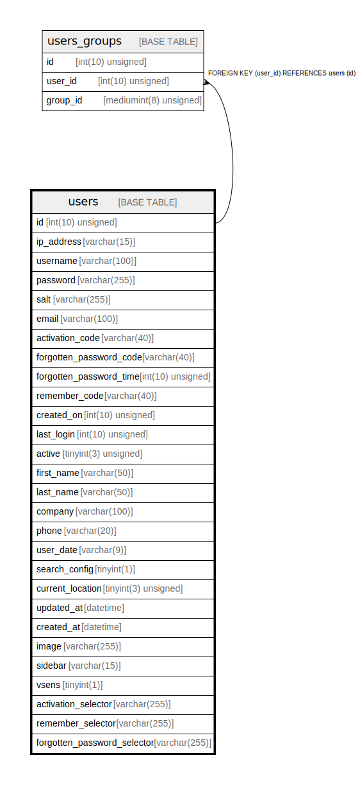

# users

## Description

<details>
<summary><strong>Table Definition</strong></summary>

```sql
CREATE TABLE `users` (
  `id` int(10) unsigned NOT NULL AUTO_INCREMENT,
  `ip_address` varchar(15) NOT NULL,
  `username` varchar(100) NOT NULL,
  `password` varchar(255) NOT NULL,
  `salt` varchar(255) DEFAULT NULL,
  `email` varchar(100) NOT NULL,
  `activation_code` varchar(40) DEFAULT NULL,
  `forgotten_password_code` varchar(40) DEFAULT NULL,
  `forgotten_password_time` int(10) unsigned DEFAULT NULL,
  `remember_code` varchar(40) DEFAULT NULL,
  `created_on` int(10) unsigned NOT NULL,
  `last_login` int(10) unsigned DEFAULT NULL,
  `active` tinyint(3) unsigned DEFAULT NULL,
  `first_name` varchar(50) DEFAULT NULL,
  `last_name` varchar(50) DEFAULT NULL,
  `company` varchar(100) DEFAULT NULL,
  `phone` varchar(20) DEFAULT NULL,
  `user_date` varchar(9) NOT NULL DEFAULT 'd-m-Y',
  `search_config` tinyint(1) NOT NULL DEFAULT 0,
  `current_location` tinyint(3) unsigned NOT NULL,
  `updated_at` datetime DEFAULT current_timestamp(),
  `created_at` datetime DEFAULT NULL,
  `image` varchar(255) NOT NULL,
  `sidebar` varchar(15) NOT NULL,
  `vsens` tinyint(1) NOT NULL DEFAULT 0,
  `activation_selector` varchar(255) DEFAULT NULL,
  `remember_selector` varchar(255) DEFAULT NULL,
  `forgotten_password_selector` varchar(255) DEFAULT NULL,
  PRIMARY KEY (`id`)
) ENGINE=InnoDB AUTO_INCREMENT=[Redacted by tbls] DEFAULT CHARSET=utf8mb3 COLLATE=utf8mb3_general_ci
```

</details>

## Columns

| Name | Type | Default | Nullable | Extra Definition | Children | Parents | Comment |
| ---- | ---- | ------- | -------- | ---------------- | -------- | ------- | ------- |
| id | int(10) unsigned |  | false | auto_increment | [users_groups](users_groups.md) |  |  |
| ip_address | varchar(15) |  | false |  |  |  |  |
| username | varchar(100) |  | false |  |  |  |  |
| password | varchar(255) |  | false |  |  |  |  |
| salt | varchar(255) | NULL | true |  |  |  |  |
| email | varchar(100) |  | false |  |  |  |  |
| activation_code | varchar(40) | NULL | true |  |  |  |  |
| forgotten_password_code | varchar(40) | NULL | true |  |  |  |  |
| forgotten_password_time | int(10) unsigned | NULL | true |  |  |  |  |
| remember_code | varchar(40) | NULL | true |  |  |  |  |
| created_on | int(10) unsigned |  | false |  |  |  |  |
| last_login | int(10) unsigned | NULL | true |  |  |  |  |
| active | tinyint(3) unsigned | NULL | true |  |  |  |  |
| first_name | varchar(50) | NULL | true |  |  |  |  |
| last_name | varchar(50) | NULL | true |  |  |  |  |
| company | varchar(100) | NULL | true |  |  |  |  |
| phone | varchar(20) | NULL | true |  |  |  |  |
| user_date | varchar(9) | 'd-m-Y' | false |  |  |  |  |
| search_config | tinyint(1) | 0 | false |  |  |  |  |
| current_location | tinyint(3) unsigned |  | false |  |  |  |  |
| updated_at | datetime | current_timestamp() | true |  |  |  |  |
| created_at | datetime | NULL | true |  |  |  |  |
| image | varchar(255) |  | false |  |  |  |  |
| sidebar | varchar(15) |  | false |  |  |  |  |
| vsens | tinyint(1) | 0 | false |  |  |  |  |
| activation_selector | varchar(255) | NULL | true |  |  |  |  |
| remember_selector | varchar(255) | NULL | true |  |  |  |  |
| forgotten_password_selector | varchar(255) | NULL | true |  |  |  |  |

## Constraints

| Name | Type | Definition |
| ---- | ---- | ---------- |
| PRIMARY | PRIMARY KEY | PRIMARY KEY (id) |

## Indexes

| Name | Definition |
| ---- | ---------- |
| PRIMARY | PRIMARY KEY (id) USING BTREE |

## Relations



---

> Generated by [tbls](https://github.com/k1LoW/tbls)
