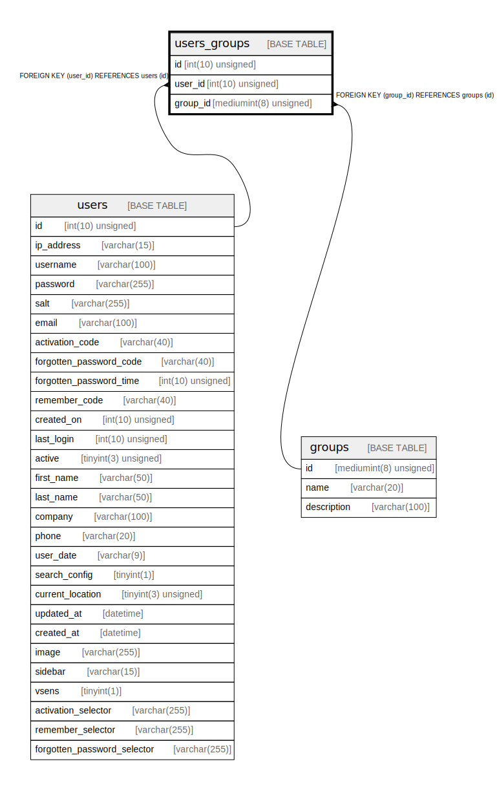

# users_groups

## Description

<details>
<summary><strong>Table Definition</strong></summary>

```sql
CREATE TABLE `users_groups` (
  `id` int(10) unsigned NOT NULL AUTO_INCREMENT,
  `user_id` int(10) unsigned NOT NULL,
  `group_id` mediumint(8) unsigned NOT NULL,
  PRIMARY KEY (`id`),
  UNIQUE KEY `uc_users_groups` (`user_id`,`group_id`),
  KEY `fk_users_groups_users1_idx` (`user_id`),
  KEY `fk_users_groups_groups1_idx` (`group_id`),
  CONSTRAINT `fk_users_groups_groups1` FOREIGN KEY (`group_id`) REFERENCES `groups` (`id`) ON DELETE CASCADE,
  CONSTRAINT `fk_users_groups_users1` FOREIGN KEY (`user_id`) REFERENCES `users` (`id`) ON DELETE CASCADE
) ENGINE=InnoDB AUTO_INCREMENT=[Redacted by tbls] DEFAULT CHARSET=utf8mb3 COLLATE=utf8mb3_general_ci
```

</details>

## Columns

| Name | Type | Default | Nullable | Extra Definition | Children | Parents | Comment |
| ---- | ---- | ------- | -------- | ---------------- | -------- | ------- | ------- |
| id | int(10) unsigned |  | false | auto_increment |  |  |  |
| user_id | int(10) unsigned |  | false |  |  | [users](users.md) |  |
| group_id | mediumint(8) unsigned |  | false |  |  | [groups](groups.md) |  |

## Constraints

| Name | Type | Definition |
| ---- | ---- | ---------- |
| fk_users_groups_groups1 | FOREIGN KEY | FOREIGN KEY (group_id) REFERENCES groups (id) |
| fk_users_groups_users1 | FOREIGN KEY | FOREIGN KEY (user_id) REFERENCES users (id) |
| PRIMARY | PRIMARY KEY | PRIMARY KEY (id) |
| uc_users_groups | UNIQUE | UNIQUE KEY uc_users_groups (user_id, group_id) |

## Indexes

| Name | Definition |
| ---- | ---------- |
| fk_users_groups_groups1_idx | KEY fk_users_groups_groups1_idx (group_id) USING BTREE |
| fk_users_groups_users1_idx | KEY fk_users_groups_users1_idx (user_id) USING BTREE |
| PRIMARY | PRIMARY KEY (id) USING BTREE |
| uc_users_groups | UNIQUE KEY uc_users_groups (user_id, group_id) USING BTREE |

## Relations



---

> Generated by [tbls](https://github.com/k1LoW/tbls)
