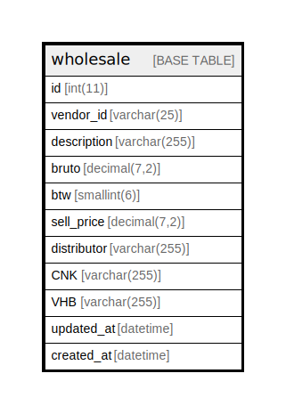

# wholesale

## Description

<details>
<summary><strong>Table Definition</strong></summary>

```sql
CREATE TABLE `wholesale` (
  `id` int(11) NOT NULL AUTO_INCREMENT,
  `vendor_id` varchar(25) CHARACTER SET utf8mb4 COLLATE utf8mb4_unicode_520_ci NOT NULL,
  `description` varchar(255) CHARACTER SET utf8mb3 COLLATE utf8mb3_unicode_520_ci NOT NULL,
  `bruto` decimal(7,2) NOT NULL,
  `btw` smallint(6) NOT NULL,
  `sell_price` decimal(7,2) NOT NULL,
  `distributor` varchar(255) CHARACTER SET utf8mb4 COLLATE utf8mb4_unicode_520_ci NOT NULL,
  `CNK` varchar(255) CHARACTER SET utf8mb3 COLLATE utf8mb3_unicode_520_ci NOT NULL,
  `VHB` varchar(255) CHARACTER SET utf8mb3 COLLATE utf8mb3_unicode_520_ci NOT NULL,
  `updated_at` datetime DEFAULT NULL,
  `created_at` datetime DEFAULT NULL,
  PRIMARY KEY (`id`),
  UNIQUE KEY `vendor_id` (`vendor_id`)
) ENGINE=InnoDB AUTO_INCREMENT=[Redacted by tbls] DEFAULT CHARSET=utf8mb4 COLLATE=utf8mb4_general_ci
```

</details>

## Columns

| Name | Type | Default | Nullable | Extra Definition | Children | Parents | Comment |
| ---- | ---- | ------- | -------- | ---------------- | -------- | ------- | ------- |
| id | int(11) |  | false | auto_increment |  |  |  |
| vendor_id | varchar(25) |  | false |  |  |  |  |
| description | varchar(255) |  | false |  |  |  |  |
| bruto | decimal(7,2) |  | false |  |  |  |  |
| btw | smallint(6) |  | false |  |  |  |  |
| sell_price | decimal(7,2) |  | false |  |  |  |  |
| distributor | varchar(255) |  | false |  |  |  |  |
| CNK | varchar(255) |  | false |  |  |  |  |
| VHB | varchar(255) |  | false |  |  |  |  |
| updated_at | datetime | NULL | true |  |  |  |  |
| created_at | datetime | NULL | true |  |  |  |  |

## Constraints

| Name | Type | Definition |
| ---- | ---- | ---------- |
| PRIMARY | PRIMARY KEY | PRIMARY KEY (id) |
| vendor_id | UNIQUE | UNIQUE KEY vendor_id (vendor_id) |

## Indexes

| Name | Definition |
| ---- | ---------- |
| PRIMARY | PRIMARY KEY (id) USING BTREE |
| vendor_id | UNIQUE KEY vendor_id (vendor_id) USING BTREE |

## Relations



---

> Generated by [tbls](https://github.com/k1LoW/tbls)
